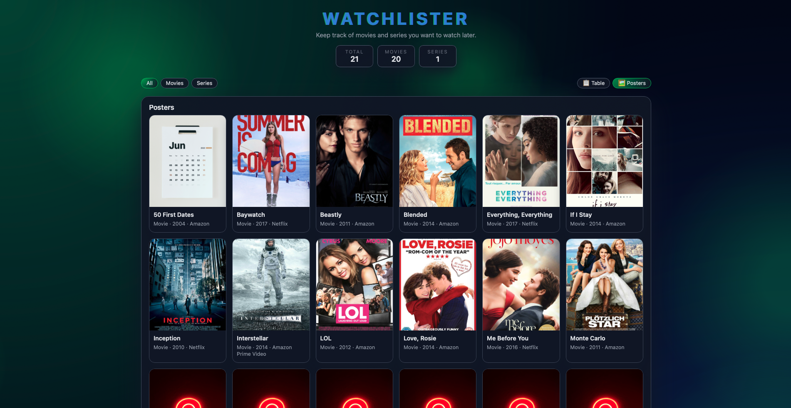

# WatchLister

## Project description

This project is a web application developed in HTML, CSS and JavaScript.  
Its purpose is to manage a personal list of movies and TV series that I want to watch later.

The application is inspired by the contact manager example studied in **Module 5**, but adapted to a different context and extended with additional features.
---

## Main features

### Movie / Series management
Each movie or series can contain the following information:
- Title  
- Platform (Netflix, Amazon Prime, etc.)  
- Main actors  
- Main category (Movie or Series)  
- Sub-category (Drama, Comedy, Sci-Fi, etc.)  
- Release year (optional)  
- Poster image  
- Trailer link (YouTube)

Users can:
- Add a new movie or series using a form  
- Delete an entry using a trash icon  
- Save the list to LocalStorage  

---

### Dynamic table
- The list of movies/series is displayed in a dynamically generated table/posters ( grid view )
- The table updates automatically when:
  - a movie is added or deleted
  - a search or filter is applied
  - pagination is also used in case of table view
- Poster images are displayed directly in the table
- Trailers are shown as a clickable “Trailer” button that opens YouTube in a new tab if they have been added

---

### Search and filters
- Live search while typing
- Custom dropdown menu to choose the search mode:
  - Title
  - Platform
  - Actors
  - Genre
- The table is rebuilt dynamically according to the selected search criteria

---

### Sorting and pagination
- Table headers can be clicked to sort the data
- Pagination displays 10 movies/series per page
- Previous and Next buttons are automatically disabled when needed depending on which page you are on
---

### Two Views
- A view which allows for editing as a table
- A view as Posters that is more intuitive
---

### Editable table cells (advanced feature)
- Some table cells can be edited directly by clicking on them
- When clicked, the text becomes an input field
- Changes are validated and saved when the input loses focus
- This feature uses `classList.add()`, `remove()` and `toggle()` as requested

---

## User interface and animations

- Modern dark theme with green and blue accents
- Responsive layout
- Hover effects on buttons, rows and images
- Animated title with a color gradient ( Glitch beheviour )
- Subtle animations when the table content changes
- Animated canvas background with smooth floating blobs for a more dynamic appearance

---

## Data persistence

- The movie/series list is stored in **LocalStorage**
- Data is saved using JSON serialization
- The list is restored when the page is reloaded

---

## Technologies used

- HTML5  
- CSS 
- JavaScript
  - Classes  
  - Event listeners  
  - DOM manipulation  
  - LocalStorage  
  - Canvas API  

No external libraries or frameworks were used.

---

## How to run the project

1. Open the `index.html` file in a web browser
2. Add movies or series using the form
3. Save or load the list using the provided buttons

No installation, server nor database is required.

---

## Conclusion

This project allowed me to apply the concepts studied in class, especially JavaScript classes, dynamic DOM manipulation, and LocalStorage.  
